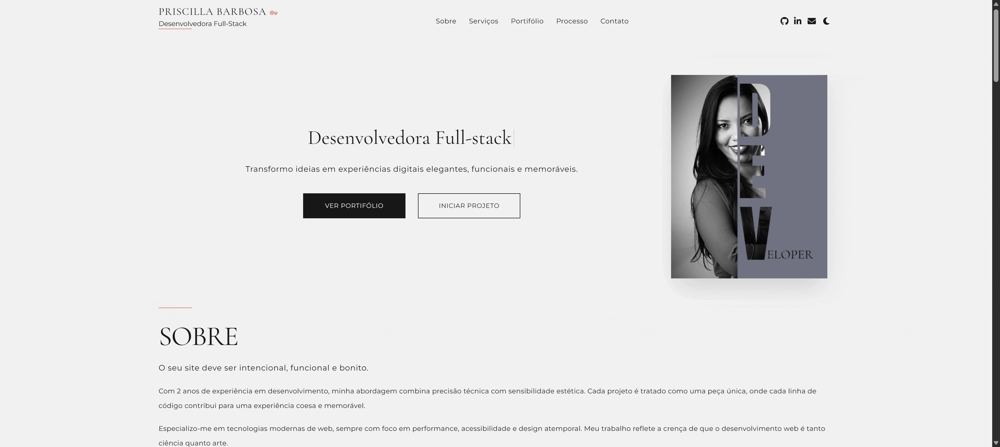

# 🌐 Portfólio - Priscilla Barbosa

Bem-vindo(a) ao meu portfólio! 🚀  
Este projeto é uma **landing page** criada para apresentar meus trabalhos, habilidades e informações de contato. Trata-se de uma aplicação Fullstack composta por uma **Landing Page** interativa para apresentação profissional e uma **API Backend** para gerenciamento de dados e contatos. 
Foi desenvolvido utilizando **HTML, CSS, JavaScript, Express e Node.js**.

---

## 📸 Demonstração e Links

👉 [https://priscillabarbosa-developer.vercel.app/]

👉 **Frontend (Deploy):** [Acessar Portfólio Online](https://priscillabarbosa-developer.vercel.app/)
👉 **Repositório Frontend:** [github.com/PriscillaBarbosa/priscillabarbosa-developer](https://github.com/PriscillaBarbosa/priscillabarbosa-developer)
* **Repositório Backend:** [github.com/PriscillaBarbosa/backend-portifolio](https://github.com/PriscillaBarbosa/backend-portifolio)
---

## 🛠 Tecnologias utilizadas

O projeto foi desenvolvido utilizando uma arquitetura moderna e desacoplada:

### 🎨 Frontend (Interface)
* **HTML5 & CSS3:** Estrutura semântica e estilização avançada.
* **JavaScript (ES6+):** Interatividade e consumo de APIs.
* **Bootstrap 5:** Framework para layout responsivo e componentes ágeis.

### ⚙️ Backend (API)
* **Node.js:** Ambiente de execução JavaScript no servidor.
* **Express.js:** Framework para criação de rotas e middleware.
* **Arquitetura MVC:** Organização em *Models*, *Controllers* e *Services* (conforme estrutura do repositório).
---

##  Estrutura

priscillabarbosa.developer/
│── assets/       # Arquivos estáticos (CSS, JS, imagens)
│── backend/      
    ├── controllers/     # Lógica de controle das requisições
    ├── routes/          # Definição das rotas da API
    ├── services/        # Regras de negócio
    └── server.js        # Ponto de entrada do servidor
│── index.html    # Página    

---

## ✨ Funcionalidades

✅ Design Responsivo: Adaptável para mobile, tablet e desktop.

✅ Navegação Intuitiva: Seções claras sobre projetos, habilidades e contato.

✅ Integração com API: Comunicação entre a interface e o servidor Node.js (ex: formulário de contato).

---

## 👩‍💻 Autora & Desenvolvedora
 - Priscilla Barbosa

 Desenvolvido com 💜 por Priscilla Barbosa.

🌍 Portfólio -> https://priscillabarbosa-developer.vercel.app/

💼 LinkedIn -> https://www.linkedin.com/in/priscillabarbosa-developer/

🐙 GitHub -> [github.com/PriscillaBarbosa](https://github.com/PriscillaBarbosa)
